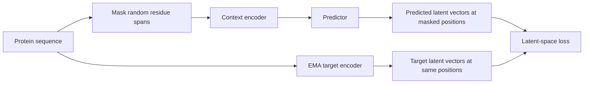
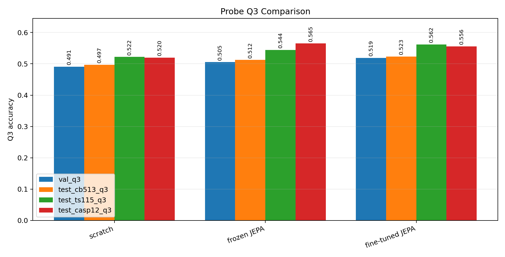

# Protein-I-JEPA

This repository contains a small, readable implementation of an I-JEPA-style
self-supervised model for protein sequences.

The goal is not to compete with ESM or AlphaFold-scale systems. The goal is to
teach and test the JEPA idea on a real scientific data type: amino-acid
sequences.

## What JEPA Means

JEPA stands for Joint Embedding Predictive Architecture. The important idea is
that the model predicts **representations** of hidden information, not the raw
hidden tokens.

A masked language model does this:

```text
visible protein sequence -> predict missing amino-acid identities
```

This Protein-I-JEPA does this:

```text
visible protein sequence -> predict the target encoder's latent vectors
```

The practical difference is the prediction target:

```text
Masked language modeling

original sequence:  A C D E F G H I K
masked input:       A C <mask> <mask> F G H I K
model output:       D, E
training target:    exact amino-acid tokens

Protein-I-JEPA

original sequence:  A C D E F G H I K
masked input:       A C <mask> <mask> F G H I K
context encoder:    masked sequence -> context representations
target encoder:     full sequence   -> target representations
predictor output:   predicted vectors for the masked positions
training target:    target encoder vectors, not token identities
```



The training loop has three learned components:

- Context encoder: sees a protein sequence where contiguous residue spans have
  been replaced by a mask token.
- Target encoder: sees the unmasked sequence and produces target latent vectors.
  It is an exponential-moving-average copy of the context encoder.
- Predictor: maps the context encoder output at masked positions to the target
  latent vectors at those positions.

The loss compares predicted target latents to target encoder latents. It does
not ask the model to reconstruct the exact amino-acid sequence.

This is why the model is JEPA-style: it learns by predicting missing information
in representation space.

## How To Use A Trained JEPA Model

After pretraining, the JEPA model is usually used as an **encoder**, not as a
text-like generator.

```text
protein sequence -> JEPA encoder -> residue embeddings / protein embedding
```

For residue-level tasks, keep the full sequence of embeddings:

```text
L residues -> L embedding vectors
```

That is useful for:

- secondary structure
- solvent accessibility
- disorder
- binding sites
- active sites
- mutation-sensitive positions

For protein-level tasks, pool the residue embeddings:

```text
L embedding vectors -> mean/CLS/attention pool -> one protein embedding
```

That is useful for:

- enzyme class prediction
- GO/function prediction
- remote homology
- localization
- family/domain classification
- stability or fitness prediction
- embedding search and clustering

There are three common downstream modes:

```text
Frozen feature extractor:
sequence -> frozen JEPA encoder -> small task head

Fine-tuning:
sequence -> JEPA encoder + task head, all trainable

Embedding database:
protein library -> JEPA embeddings -> nearest-neighbor search / clustering
```

The secondary-structure probe in this repository is the first two modes:

```text
sequence -> JEPA encoder -> per-residue embeddings -> H/E/C classifier
```

The frozen probe is the cleanest representation test. The fine-tuned probe asks
whether JEPA gives a good initialization for a supervised biological task.

## What This Code Does

The code supports three workflows:

1. Self-supervised JEPA pretraining on unlabeled protein sequences.
2. Downstream probing to test whether the learned encoder contains biological
   information.
3. Dataset conversion helpers for creating professional secondary-structure
   probe splits.

The main entry point is:

```bash
python scripts/train_protein_jepa.py
```

Reusable package code lives in `src/protein_jepa/`:

- `alphabet.py`: amino-acid tokenization.
- `data.py`: FASTA, Hugging Face, synthetic datasets, and batch collation.
- `masking.py`: contiguous span masking.
- `model.py`: context encoder, EMA target encoder, and latent predictor.
- `train.py`: JEPA pretraining loop.
- `probe.py`: secondary-structure probe.
- `metrics.py`: JSONL/CSV logging and PNG/SVG plots.
- `visualize.py`: predicted-vs-target latent embedding plots.
- `report.py`: Markdown report generation from saved run directories.
- `download_secondary.py`: download/convert secondary-structure labels to TSV.
- `download_netsurfp.py`: download/convert NetSurfP train/validation/test splits
  to TSV.
- `publish_hf_secondary.py`: stage and upload NetSurfP probe splits to a
  Hugging Face dataset repo.

Tests live in `tests/`.

## Install And Test

The local environment already has PyTorch. To run the unit and smoke tests:

```bash
python -m unittest discover -s tests
```

For Hugging Face datasets and dataset publishing, install the optional
dependencies if needed:

```bash
python -m pip install datasets huggingface_hub
```

## End-To-End Runbook

This is the full command sequence for a real run: train JEPA on UniRef50,
prepare professional secondary-structure splits, train probes, evaluate external
tests, and build one Markdown report containing the metrics and figures.

This workflow writes NetSurfP-derived TSV files under `data/netsurfp/`, trains
JEPA, trains probes, evaluates CB513/TS115/CASP12, and writes one report.

1. Confirm the code works:

```bash
python -m unittest discover -s tests
```

2. Download and convert the NetSurfP-3.0 secondary-structure splits:

```bash
python scripts/download_netsurfp.py \
  --output-dir data/netsurfp
```

This uses the official NetSurfP-3.0 dataset page by default:
<https://services.healthtech.dtu.dk/services/NetSurfP-3.0/5-Dataset.php>.
It creates:

- `data/netsurfp/train.tsv`: train the probe.
- `data/netsurfp/validation.tsv`: tune the probe.
- `data/netsurfp/cb513.tsv`: final external test.
- `data/netsurfp/ts115.tsv`: final external test.
- `data/netsurfp/casp12.tsv`: final external test.

If you have a CASP14_FM file, add it with `--casp14-fm-npz path/to/file.npz` or
`--casp14-fm-tsv path/to/file.tsv`; it will be written as
`data/netsurfp/casp14_fm.tsv`.

3. Optionally publish the NetSurfP splits to Hugging Face:

```bash
huggingface-cli login

python scripts/publish_netsurfp_to_hf.py \
  --repo-id lamm-mit/protein-secondary-structure-netsurfp \
  --output-dir data/netsurfp \
  --staging-dir data/netsurfp_hf
```

Use `--dry-run` first if you want to verify the staged JSONL/TSV files without
uploading. The uploaded repo contains JSONL files for direct Hugging Face use
and TSV copies under `tsv/`.

4. Pretrain Protein-I-JEPA on a bounded UniRef50 sample:

```bash
python scripts/train_protein_jepa.py pretrain \
  --hf-dataset lamm-mit/UniRef50_512_all \
  --max-sequences 10000 \
  --steps 1000 \
  --batch-size 32 \
  --max-length 256 \
  --device auto \
  --output-dir runs/uniref50_jepa
```
Larger dataset:

```bash
python scripts/train_protein_jepa.py pretrain \
  --hf-dataset lamm-mit/UniRef50_512_all \
  --max-sequences 100000 \
  --steps 1000 \
  --batch-size 128 \
  --max-length 256 \
  --device auto \
  --output-dir runs/uniref50_jepa
```

Note:

```
--max-sequences 100000 --steps 1000 --batch-size 128  -> ~1.28 epochs
--max-sequences 100000 --steps 5000 --batch-size 128  -> ~6.4 epochs
--max-sequences 10000  --steps 1000 --batch-size 128  -> ~12.8 epochs
```

5. Train a frozen secondary-structure probe on the JEPA encoder.

This is the `frozen JEPA` condition in the report plots: JEPA is pretrained,
the encoder is frozen, and only the secondary-structure head is trained.

Local TSV version:

```bash
python scripts/train_protein_jepa.py probe-secondary \
  --checkpoint runs/uniref50_jepa/protein_jepa.pt \
  --train-labels-tsv data/netsurfp/train.tsv \
  --val-labels-tsv data/netsurfp/validation.tsv \
  --test-labels-tsv data/netsurfp/cb513.tsv \
  --test-labels-tsv data/netsurfp/ts115.tsv \
  --test-labels-tsv data/netsurfp/casp12.tsv \
  --steps 500 \
  --batch-size 32 \
  --max-length 256 \
  --device auto \
  --output-dir runs/secondary_probe_jepa
```

Hugging Face version after publishing:

```bash
python scripts/train_protein_jepa.py probe-secondary \
  --checkpoint runs/uniref50_jepa/protein_jepa.pt \
  --hf-dataset lamm-mit/protein-secondary-structure-netsurfp \
  --hf-train-split train \
  --hf-val-split validation \
  --hf-test-split cb513 \
  --hf-test-split ts115 \
  --hf-test-split casp12 \
  --steps 500 \
  --batch-size 32 \
  --max-length 256 \
  --device auto \
  --output-dir runs/secondary_probe_jepa
```

6. Train a scratch probe baseline with no JEPA checkpoint:

This is the `scratch` condition: there is no JEPA pretraining checkpoint. The
baseline uses a randomly initialized encoder, so it tests what performance looks
like without a learned JEPA representation.

```bash
python scripts/train_protein_jepa.py probe-secondary \
  --train-labels-tsv data/netsurfp/train.tsv \
  --val-labels-tsv data/netsurfp/validation.tsv \
  --test-labels-tsv data/netsurfp/cb513.tsv \
  --test-labels-tsv data/netsurfp/ts115.tsv \
  --test-labels-tsv data/netsurfp/casp12.tsv \
  --steps 500 \
  --batch-size 32 \
  --max-length 256 \
  --device auto \
  --output-dir runs/secondary_probe_scratch
```

7. Optionally fine-tune the JEPA encoder during probing:

This is the `fine-tuned JEPA` condition: the JEPA checkpoint initializes the
encoder, then both the encoder and secondary-structure head are trained on the
labeled probe data.

```bash
python scripts/train_protein_jepa.py probe-secondary \
  --checkpoint runs/uniref50_jepa/protein_jepa.pt \
  --train-labels-tsv data/netsurfp/train.tsv \
  --val-labels-tsv data/netsurfp/validation.tsv \
  --test-labels-tsv data/netsurfp/cb513.tsv \
  --test-labels-tsv data/netsurfp/ts115.tsv \
  --test-labels-tsv data/netsurfp/casp12.tsv \
  --unfreeze-encoder \
  --steps 500 \
  --batch-size 32 \
  --max-length 256 \
  --device auto \
  --output-dir runs/secondary_probe_finetuned
```

8. Plot predicted versus target JEPA latents in 2D:

```bash
python scripts/train_protein_jepa.py plot-embeddings \
  --checkpoint runs/uniref50_jepa/protein_jepa.pt \
  --hf-dataset lamm-mit/UniRef50_512_all \
  --max-sequences 512 \
  --num-batches 8 \
  --max-points 2000 \
  --device auto \
  --output-dir runs/uniref50_jepa
```

This writes `embedding_predicted_vs_target.png` and
`embedding_predicted_vs_target.svg`.

9. Build a report that embeds all generated figures:

```bash
python scripts/make_training_report.py \
  --pretrain-dir runs/uniref50_jepa \
  --probe-dir runs/secondary_probe_jepa \
  --probe-dir runs/secondary_probe_scratch \
  --probe-dir runs/secondary_probe_finetuned \
  --output runs/reports/uniref50_jepa_report.md
```

The report is written to `runs/reports/uniref50_jepa_report.md`. It embeds the PNG
figures and links the SVG versions so you can use either bitmap or vector
graphics in slides and documents. It also prints and saves a probe-comparison
table across all `--probe-dir` runs, including `val_q3` and any external test
metrics such as `test_cb513_q3`, `test_ts115_q3`, and `test_casp12_q3`. The
report directory also gets `probe_comparison.png` and `probe_comparison.svg`,
which are embedded/linked from the report. The comparison is ordered as
`scratch -> frozen JEPA -> fine-tuned JEPA` when those run names are present.



If you do not have a labeled secondary-structure dataset yet, run the complete
synthetic smoke workflow instead:

```bash
python scripts/train_protein_jepa.py pretrain \
  --synthetic \
  --steps 10 \
  --batch-size 8 \
  --max-length 96 \
  --device auto \
  --output-dir runs/smoke

python scripts/train_protein_jepa.py probe-secondary \
  --checkpoint runs/smoke/protein_jepa.pt \
  --synthetic \
  --steps 10 \
  --batch-size 8 \
  --max-length 96 \
  --device auto \
  --output-dir runs/probe-smoke

python scripts/train_protein_jepa.py plot-embeddings \
  --checkpoint runs/smoke/protein_jepa.pt \
  --synthetic \
  --num-batches 2 \
  --max-points 500 \
  --device auto \
  --output-dir runs/smoke

python scripts/make_training_report.py \
  --pretrain-dir runs/smoke \
  --probe-dir runs/probe-smoke \
  --output runs/reports/smoke_report.md
```

## Pretraining

Pretraining uses unlabeled sequences only. Each batch is tokenized, contiguous
residue spans are masked, and the model learns to predict the target encoder's
latent vectors at those masked positions.

Run a tiny synthetic smoke job:

```bash
python scripts/train_protein_jepa.py pretrain \
  --synthetic \
  --steps 10 \
  --batch-size 8 \
  --max-length 96 \
  --output-dir runs/smoke
```

Train from a local FASTA file:

```bash
python scripts/train_protein_jepa.py pretrain \
  --fasta data/uniref_sample.fasta \
  --steps 1000 \
  --batch-size 32 \
  --output-dir runs/protein_jepa
```

Train from the Hugging Face UniRef50 dataset:

```bash
python scripts/train_protein_jepa.py pretrain \
  --hf-dataset lamm-mit/UniRef50_512_all \
  --max-sequences 10000 \
  --steps 1000 \
  --batch-size 32 \
  --output-dir runs/uniref50_jepa
```

The default Hugging Face fields match `lamm-mit/UniRef50_512_all`:

- `Sequence`: amino-acid sequence.
- `Seq_Length`: sequence length.

For another dataset, override the field names:

```bash
python scripts/train_protein_jepa.py pretrain \
  --hf-dataset owner/dataset_name \
  --hf-sequence-field sequence \
  --hf-length-field length \
  --max-sequences 10000
```

For very large datasets, keep `--max-sequences` set. You can also pass a split
slice:

```bash
python scripts/train_protein_jepa.py pretrain \
  --hf-dataset lamm-mit/UniRef50_512_all \
  --hf-split 'train[:50000]'
```

## Model Size

The encoder is a Transformer encoder. You can control its size during JEPA
pretraining with:

- `--embed-dim`: hidden width of each residue representation.
- `--depth`: number of Transformer encoder blocks.
- `--num-heads`: attention heads per block.
- `--dropout`: dropout inside the Transformer.
- `--max-length`: maximum sequence length and positional embedding length.

Example larger pretraining run:

```bash
python scripts/train_protein_jepa.py pretrain \
  --hf-dataset lamm-mit/UniRef50_512_all \
  --max-sequences 10000 \
  --embed-dim 256 \
  --depth 6 \
  --num-heads 8 \
  --dropout 0.1 \
  --max-length 256 \
  --steps 1000 \
  --batch-size 32 \
  --output-dir runs/uniref50_jepa_256d_6l
```

For frozen or fine-tuned JEPA probes, the encoder size comes from the checkpoint
you pass with `--checkpoint`. Set the size during pretraining, not during the
probe command. For a scratch probe baseline with no checkpoint, the probe
command's `--embed-dim`, `--depth`, `--num-heads`, `--dropout`, and
`--max-length` define the randomly initialized encoder.

## Pretraining Outputs

Each pretraining run writes these files to `--output-dir`:

- `config.json`: exact run configuration.
- `protein_jepa.pt`: checkpoint containing model weights, config, alphabet, and
  final metrics.
- `metrics.jsonl`: one JSON object per logging step.
- `metrics.csv`: same metrics in a spreadsheet-friendly format.
- `training_curves.png`: raster plot for reports and notebooks.
- `training_curves.svg`: vector plot for slides and papers.
- `embedding_predicted_vs_target.png`: 2D PCA plot of predicted and target JEPA
  latents, if you run `plot-embeddings`.
- `embedding_predicted_vs_target.svg`: vector version of the embedding plot.

The logged metrics include:

- `train_loss`: total JEPA training loss.
- `latent_loss`: representation prediction loss.
- `variance_loss`: small anti-collapse regularizer.
- `val_loss`: held-out JEPA validation loss.
- `latent_cosine`: cosine similarity between predicted and target latents on
  the training batch.
- `val_cosine`: same alignment metric on validation batches.
- `pred_std`: standard deviation of predicted latents.
- `target_std`: standard deviation of target latents.
- `targets_per_batch`: number of masked residue positions used for the JEPA
  objective.

How to read the curves:

- Falling `train_loss` and `val_loss` means the predictor is getting better at
  matching target latents.
- Rising or stable positive `val_cosine` means predicted latents are becoming
  directionally aligned with target latents.
- Very small `pred_std` can indicate representation collapse, where the model
  predicts nearly the same vector everywhere.
- A large train/validation gap suggests overfitting to the sampled sequences or
  too little validation data.

## Embedding Visualization

The `plot-embeddings` command visualizes what the JEPA objective is doing. It
loads a checkpoint, samples masked spans, collects two sets of vectors, and
projects them to two dimensions with PCA:

- predicted latents: the predictor output from the masked context.
- target latents: the EMA target encoder output from the unmasked sequence.

Run it on the same sequence source used for pretraining:

```bash
python scripts/train_protein_jepa.py plot-embeddings \
  --checkpoint runs/uniref50_jepa/protein_jepa.pt \
  --hf-dataset lamm-mit/UniRef50_512_all \
  --max-sequences 512 \
  --num-batches 8 \
  --max-points 2000 \
  --device auto \
  --output-dir runs/uniref50_jepa
```

The plot is saved as:

- `embedding_predicted_vs_target.png`
- `embedding_predicted_vs_target.svg`

How to interpret it:

- If predicted and target clouds overlap more over training, the predictor is
  learning to match the target latent distribution.
- Shorter gray lines between matched predicted/target points indicate better
  per-position latent prediction in the 2D projection.
- If predicted points collapse into a tiny cluster while target points remain
  spread out, the model may be collapsing or the predictor may be too weak.
- This is a qualitative visualization. Use `val_loss`, `val_cosine`, and
  downstream probe accuracy for quantitative judgment.

## Probes

A probe is a small supervised model trained on top of the learned encoder. It is
used after self-supervised pretraining to ask:

> Did the unlabeled JEPA model learn representations that contain useful
> biological information?

The implemented probe is a Q3 secondary-structure probe.

Secondary structure is a per-residue label:

- `H`: helix.
- `E`: beta strand.
- `C`: coil/other.

The probe takes a sequence, runs it through the JEPA context encoder, and trains
a small linear classifier to predict one secondary-structure label per residue.
By default the encoder is frozen. That matters: if the frozen encoder performs
well, the structural information was already present in the representation
learned from unlabeled sequences.

## Probe Data Format

The secondary-structure probe expects a TSV file with two columns:

```text
sequence	labels
ACDEFGHIK	CCHHHCEEE
```

The `sequence` column contains amino-acid sequences. The `labels` column
contains one secondary-structure character per residue.

Labels may be Q3:

- `C`
- `E`
- `H`

or DSSP-style Q8:

- helix-like: `H`, `G`, `I`
- strand-like: `E`, `B`
- coil-like: `C`, `S`, `T`, `-`

Q8 labels are automatically mapped to Q3.

The special label `.` means "ignore this residue for the supervised loss and
accuracy." The NetSurfP converter uses this to respect external-test evaluation
masks while preserving the full sequence context.

For a serious probe workflow, create explicit train, validation, and external
test TSV files from NetSurfP-3.0:

```bash
python scripts/download_netsurfp.py \
  --output-dir data/netsurfp
```

The resulting split policy is:

- `data/netsurfp/train.tsv`: train the supervised probe.
- `data/netsurfp/validation.tsv`: tune probe settings and pick checkpoints.
- `data/netsurfp/cb513.tsv`: final external test.
- `data/netsurfp/ts115.tsv`: final external test.
- `data/netsurfp/casp12.tsv`: final external test.
- `data/netsurfp/casp14_fm.tsv`: optional final external test if you provide
  `--casp14-fm-npz` or `--casp14-fm-tsv`.

You can also stage and upload those splits into the `lamm-mit` Hugging Face
account:

```bash
huggingface-cli login

python scripts/publish_netsurfp_to_hf.py \
  --repo-id lamm-mit/protein-secondary-structure-netsurfp \
  --output-dir data/netsurfp \
  --staging-dir data/netsurfp_hf
```

That command downloads/converts NetSurfP, writes upload-ready JSONL files, keeps
TSV copies, creates a dataset card, and uploads the folder through the Hugging
Face Hub API. Use `--dry-run` to do everything except the upload.

Train a frozen probe from a JEPA checkpoint and evaluate the external tests:

```bash
python scripts/train_protein_jepa.py probe-secondary \
  --checkpoint runs/uniref50_jepa/protein_jepa.pt \
  --train-labels-tsv data/netsurfp/train.tsv \
  --val-labels-tsv data/netsurfp/validation.tsv \
  --test-labels-tsv data/netsurfp/cb513.tsv \
  --test-labels-tsv data/netsurfp/ts115.tsv \
  --test-labels-tsv data/netsurfp/casp12.tsv \
  --steps 500 \
  --output-dir runs/secondary_probe_jepa
```

Or train the same probe from the uploaded Hugging Face dataset:

```bash
python scripts/train_protein_jepa.py probe-secondary \
  --checkpoint runs/uniref50_jepa/protein_jepa.pt \
  --hf-dataset lamm-mit/protein-secondary-structure-netsurfp \
  --hf-train-split train \
  --hf-val-split validation \
  --hf-test-split cb513 \
  --hf-test-split ts115 \
  --hf-test-split casp12 \
  --steps 500 \
  --output-dir runs/secondary_probe_jepa
```

Train a scratch baseline with the same explicit splits:

```bash
python scripts/train_protein_jepa.py probe-secondary \
  --train-labels-tsv data/netsurfp/train.tsv \
  --val-labels-tsv data/netsurfp/validation.tsv \
  --test-labels-tsv data/netsurfp/cb513.tsv \
  --test-labels-tsv data/netsurfp/ts115.tsv \
  --test-labels-tsv data/netsurfp/casp12.tsv \
  --steps 500 \
  --output-dir runs/secondary_probe_scratch
```

Fine-tune the encoder instead of freezing it:

```bash
python scripts/train_protein_jepa.py probe-secondary \
  --checkpoint runs/uniref50_jepa/protein_jepa.pt \
  --train-labels-tsv data/netsurfp/train.tsv \
  --val-labels-tsv data/netsurfp/validation.tsv \
  --test-labels-tsv data/netsurfp/cb513.tsv \
  --test-labels-tsv data/netsurfp/ts115.tsv \
  --test-labels-tsv data/netsurfp/casp12.tsv \
  --unfreeze-encoder \
  --steps 500 \
  --output-dir runs/secondary_probe_finetuned
```

The original simple dataset remains supported. For quick demos, the single-file
mode randomly splits one TSV into train and validation:

```bash
python scripts/download_secondary_structure.py \
  --output data/secondary_structure.tsv

python scripts/train_protein_jepa.py probe-secondary \
  --labels-tsv data/secondary_structure.tsv \
  --steps 500 \
  --output-dir runs/secondary_probe_quick
```

Run a synthetic probe smoke test:

```bash
python scripts/train_protein_jepa.py probe-secondary \
  --checkpoint runs/smoke/protein_jepa.pt \
  --synthetic \
  --steps 10 \
  --batch-size 8 \
  --max-length 96 \
  --output-dir runs/probe-smoke
```

## Probe Outputs

Each probe run writes:

- `probe_config.json`: exact probe configuration.
- `secondary_probe.pt`: probe checkpoint.
- `metrics.jsonl`: one JSON object per logging step.
- `metrics.csv`: spreadsheet-friendly probe metrics.
- `test_metrics.json`: external test metrics, if `--test-labels-tsv` or
  `--hf-test-split` was used.
- `probe_curves.png`: raster plot.
- `probe_curves.svg`: vector plot.

When you pass multiple probe directories to `scripts/make_training_report.py`,
the report starts with a `Probe Comparison` table and prints the same table in
the terminal. This is where the scratch baseline, frozen JEPA probe, and
fine-tuned JEPA probe are compared directly. It also writes
`probe_comparison.png` and `probe_comparison.svg` next to the report.

The logged probe metrics include:

- `train_loss`: supervised cross-entropy on labeled residues.
- `val_loss`: held-out supervised cross-entropy.
- `train_q3`: per-residue Q3 accuracy on the training batch.
- `val_q3`: per-residue Q3 accuracy on validation batches.
- `test_cb513_q3`, `test_ts115_q3`, `test_casp12_q3`: final external-test Q3
  accuracy when those test splits are provided.

What the probe tells us:

- If JEPA + frozen probe beats a scratch frozen encoder, the JEPA pretraining
  learned sequence features that help secondary-structure prediction.
- NetSurfP validation is for tuning. CB513, TS115, CASP12, and optional
  CASP14_FM should be treated as final external tests.
- If JEPA helps most when labeled data is scarce, it is improving label
  efficiency.
- If fine-tuning helps much more than frozen probing, the representation may be
  useful but not linearly accessible.
- If probe validation accuracy is poor while JEPA validation loss looks good,
  the model may be learning predictable sequence statistics that do not transfer
  to the biological property being tested.

The probe does not prove that the model understands full 3D structure. It tests
whether local structural information is present in the learned sequence
representations.

## Validation Already Implemented

The repository currently includes:

- Held-out JEPA validation loss.
- Latent cosine similarity on train and validation batches.
- Predicted and target latent standard deviation diagnostics for collapse.
- Q3 secondary-structure probing with frozen or fine-tuned encoders.
- Explicit NetSurfP train/validation split probing.
- External test evaluation on CB513, TS115, CASP12, and optional CASP14_FM from
  local TSVs or Hugging Face splits.
- Synthetic smoke tests for pretraining and probing.

## Good Next Validation Tasks

These are not implemented yet, but they are natural extensions:

- Solvent accessibility: per-residue buried/exposed prediction.
- Disorder prediction: per-residue ordered/disordered classification.
- Remote homology: protein-level fold or family classification with pooled
  embeddings.
- Fitness or stability prediction: mutation-effect regression/classification.
- Masked-token baseline: train an MLM on the same sequence sample and compare
  downstream probes against JEPA.

For serious scientific evaluation, prefer curated or homology-aware external
tests. Random single-TSV splits can overestimate performance because related
proteins may appear in both training and validation sets.

## Future Extensions For Coding Agents

The current code is a clean sequence-only Protein-I-JEPA scaffold. A future
coding agent can extend it into a richer protein foundation-model prototype by
adding more biological target views during pretraining.

The main design rule is:

```text
probe = tests what the representation knows
pretraining target = teaches the representation what to know
```

The current pretraining target is:

```text
masked sequence context -> target encoder latent vectors from the full sequence
```

A richer multi-view version could rotate across objectives:

```text
masked sequence context + <sequence_view>  -> sequence latent
masked sequence context + <structure_view> -> structure latent
masked sequence context + <evolution_view> -> MSA/profile latent
masked sequence context + <function_view>  -> function/domain latent
```

or predict several views at once:

```text
loss =
  sequence_jepa_loss
  + structure_jepa_loss
  + evolution_jepa_loss
  + function_jepa_loss
```

Good feature views to add:

- secondary structure, solvent accessibility, and disorder from NetSurfP-style
  labels
- contact maps or distance bins from PDB or AlphaFold structures
- backbone torsion bins or local residue-environment descriptors
- MSA/PSSM/profile features and conservation scores
- Pfam/domain, GO, EC, active-site, or binding-site annotations
- mutation fitness or stability measurements when available

Concrete multi-view examples:

```text
Sequence-only JEPA, current code:
masked amino-acid sequence
  -> context encoder
  -> predict sequence target-encoder latents at masked residues

Structure-view JEPA:
masked amino-acid sequence + <structure_view>
  -> context encoder
  -> predict latent vectors from secondary structure, solvent accessibility,
     disorder, torsion, or local 3D environment features

Evolution-view JEPA:
masked amino-acid sequence + <evolution_view>
  -> context encoder
  -> predict latent vectors from MSA profiles, PSSM columns, conservation, or
     co-evolution features

Function-view JEPA:
masked amino-acid sequence + <function_view>
  -> context encoder
  -> predict protein-level or residue-level function/domain latent vectors

Contact-view JEPA:
masked amino-acid sequence + <contact_view>
  -> context encoder
  -> predict latent vectors summarizing residue-residue contacts or distance
     bins for the masked region
```

Specification and tokenization:

Use the existing amino-acid tokenizer for the protein sequence. Do not force all
biological features into amino-acid tokens.

```text
sequence:
  input type: amino-acid string
  tokenizer: existing ProteinAlphabet
  shape after encoder: [batch, length, embed_dim]

secondary structure:
  input type: categorical per-residue labels such as H/E/C
  tokenizer: small feature vocabulary or one-hot labels
  shape after feature encoder: [batch, length, feature_dim]

solvent accessibility / disorder:
  input type: per-residue numeric values or bins
  tokenizer: none for continuous values, small vocabulary for bins
  shape after projection/encoder: [batch, length, feature_dim]

MSA/PSSM profile:
  input type: per-residue numeric vector
  tokenizer: none
  shape before projection: [batch, length, profile_dim]

contacts/distances:
  input type: pairwise matrix or local contact neighborhood
  tokenizer: none for numeric bins, optional small vocabulary for distance bins
  shape before encoder: [batch, length, length] or sparse contact features

function/domain:
  input type: protein-level or region-level categorical/multi-label annotation
  tokenizer: feature vocabulary for labels, not amino-acid vocabulary
  shape after encoder: [batch, feature_dim] or [batch, length, feature_dim]
```

The clean pattern is:

```text
ProteinAlphabet tokenizes only the amino-acid sequence.
Each biological view gets its own feature encoder or projection.
The shared context encoder predicts into the selected target view's latent
space.
```

For example, a NetSurfP-style structure view could start simple:

```text
sequence tokens:
  A C D E F G ...

aligned feature labels:
  H H E E C C ...

sequence context:
  A C <mask> <mask> F G ...

target view:
  structure encoder(H H E E C C ...) -> structure latents

loss:
  predictor(context latents at masked positions)
    vs.
  structure latents at those positions
```

A task/view token can tell the predictor what latent space to produce:

```text
<sequence_view>  -> predict sequence latents
<structure_view> -> predict structure latents
<evolution_view> -> predict MSA/profile latents
<function_view>  -> predict function/domain latents
```

Implementation roadmap:

1. Add a new dataset module that returns `sequence` plus one or more aligned
   feature views. Keep residue-level features the same length as the sequence.
2. Add a target encoder for the new view, or a small projection network if the
   view is already numeric.
3. Add a predictor head for that view. Keep the current sequence predictor
   intact.
4. Extend the training batch to include a `view_name` or task token such as
   `<sequence_view>`, `<structure_view>`, or `<evolution_view>`.
5. Compute a view-specific latent prediction loss at masked positions, using
   ignore masks where a residue lacks labels.
6. Log each loss separately, for example `sequence_loss`, `structure_loss`, and
   `evolution_loss`, plus the summed training loss.
7. Add probes that test whether the new pretraining target helped on held-out
   biological tasks.
8. Update `scripts/make_training_report.py` so the report compares both
   pretraining losses and downstream probe metrics.

Files most likely to change:

- `src/protein_jepa/data.py`: add multi-view dataset loading and collation.
- `src/protein_jepa/masking.py`: optionally add biologically informed masks,
  such as conserved-position masks or contact-neighborhood masks.
- `src/protein_jepa/model.py`: add view-specific target encoders or predictor
  heads.
- `src/protein_jepa/train.py`: add the multi-view training objective and
  metrics.
- `src/protein_jepa/probe.py`: add new probes for new biological tasks.
- `src/protein_jepa/report.py`: summarize multi-view losses and probe results.
- `tests/`: add small synthetic multi-view batches so the whole path is tested
  without downloading large biological datasets.

This is not conceptually hard, but the scientific quality depends on the target
views. A supervised label head that directly predicts `H/E/C` is useful, but it
is less JEPA-like than predicting a latent representation produced by a
structure or feature target encoder. The strongest direction is multi-view
latent prediction: sequence, structure, evolution, and function as related
views of the same protein.
